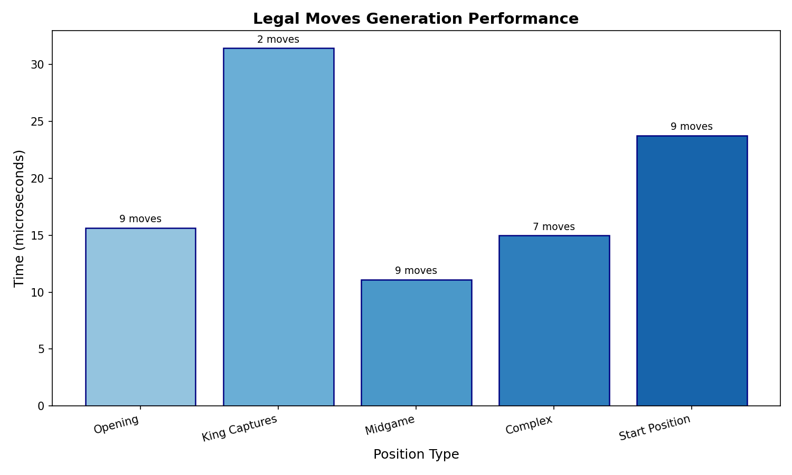
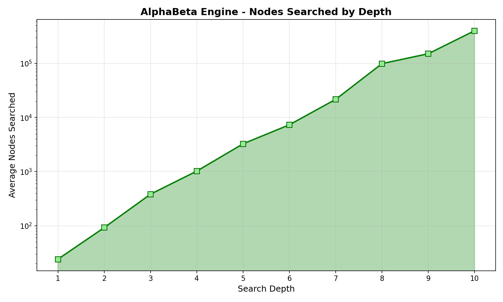

Benchmarking (Internal)
=======================

This page documents the internal benchmarking tools used for performance testing py-draughts.

Performance Results
-------------------

The following benchmarks were run on January 7, 2026.

Legal Moves Generation
~~~~~~~~~~~~~~~~~~~~~~

Performance of the legal moves generator across different board positions:

.. list-table:: Legal Moves Generation Performance
   :header-rows: 1
   :widths: 30 20 20

   * - Position Type
     - Time (µs)
     - Move Count
   * - Opening
     - 11.93
     - 9
   * - King Captures
     - 28.10
     - 2
   * - Midgame
     - 9.36
     - 9
   * - Complex
     - 12.64
     - 7
   * - Start Position
     - 24.90
     - 9

Engine Depth Performance
~~~~~~~~~~~~~~~~~~~~~~~~

AlphaBeta engine search performance at different depths:

.. image:: _static/engine_benchmark.png
   :alt: Engine Depth Benchmark
   :align: center
   :width: 80%

.. list-table:: Engine Depth Performance
   :header-rows: 1
   :widths: 15 25 30

   * - Depth
     - Avg Time
     - Avg Nodes
   * - 1
     - 1.03 ms
     - 27
   * - 2
     - 8.37 ms
     - 117
   * - 3
     - 12.64 ms
     - 312
   * - 4
     - 35.92 ms
     - 971
   * - 5
     - 130.32 ms
     - 3,525
   * - 6
     - 349.03 ms
     - 9,537
   * - 7
     - 932.85 ms
     - 25,202
   * - 8
     - 4.90 s
     - 122,168
   * - 9
     - 5.93 s
     - 153,152
   * - 10
     - 25.90 s
     - 641,085

.. image:: _static/engine_depth_time.png
   :alt: Engine Search Time by Depth
   :align: center
   :width: 80%

Overview
--------

The benchmarking system compares performance between different versions of py-draughts by:

1. Creating snapshots (wheel files) of the current version
2. Running benchmarks comparing a snapshot against the current source code

Workflow
--------

1. **Create a Snapshot**

   First, create a snapshot of the version you want to use as baseline:

   .. code-block:: bash

      python tools/create_snapshot.py

   This will:
   
   - Build a wheel file from the current source
   - Save it to ``snapshots/snapshot_YYYYMMDD_HHMMSS/``
   - Store metadata (git commit, timestamp) in ``metadata.json``

2. **Compare Versions**

   Then compare the snapshot against your current (modified) source:

   .. code-block:: bash

      # Compare latest snapshot vs current source
      python tools/compare_versions.py

      # Compare specific snapshot vs current source  
      python tools/compare_versions.py snapshots/snapshot_20251231_125057

   The comparison runs:
   
   - **Legal moves benchmark**: Measures time to generate legal moves from various positions
   - **Engine match**: Plays games between engines to compare move quality and speed

Configuration
-------------

The benchmark configuration is defined at the top of ``tools/compare_versions.py``:

.. code-block:: python

   WARMUP_ROUNDS = 5
   BENCHMARK_ROUNDS = 10
   BENCHMARK_ITERATIONS = 10
   ENGINE_DEPTH = 2
   NUM_GAMES = 20

Results
-------

Benchmark results are automatically appended to ``benchmark_results.csv`` in the project root.

Optimization Workflow
---------------------

Recommended workflow for improving engine performance:

1. **Profile**
   
   Run profiling to identify bottlenecks:

   .. code-block:: bash

      # For general engine profiling
      python tools/profile_engine_detailed.py

      # For legal moves generation specifically
      python tools/profile_legal_moves.py

2. **Improve**

   Make code changes to address identified bottlenecks.

3. **Verify Profile**

   Run the profiling script again to verify local improvements.

4. **Test**

   Ensure no regressions in functionality:

   .. code-block:: bash

      pytest .

5. **Benchmark**

   Compare against the baseline snapshot to verify performance gains:

   .. code-block:: bash

      python tools/compare_versions.py

6. **Snapshot**

   If satisfied with the results, create a new snapshot to serve as the next baseline:

   .. code-block:: bash

      python tools/create_snapshot.py

Profiling
---------

For detailed profiling of specific functions, use:

.. code-block:: bash

   python tools/profile_engine.py

Or for more detailed analysis:

.. code-block:: bash

   python tools/profile_engine_detailed.py 5  # depth 5

This uses Python's ``cProfile`` to identify bottlenecks in the engine.

Generating Benchmark Charts
---------------------------

To regenerate the benchmark charts and tables for documentation:

.. code-block:: bash

   python tools/generate_benchmark_charts.py

This will:

- Run legal moves generation benchmarks across various position types
- Run engine depth benchmarks from depth 1 to 10
- Generate PNG charts in ``docs/source/_static/``
- Output RST table content for copying into documentation

The generated charts include:

- ``legal_moves_benchmark.png`` - Bar chart of legal moves generation time by position type
- ``engine_benchmark.png`` - Combined time and nodes chart for engine depths
- ``engine_depth_time.png`` - Logarithmic time chart by depth
- ``engine_depth_nodes.png`` - Logarithmic nodes searched chart by depth

