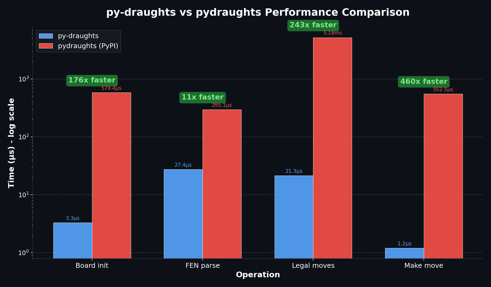

.. meta::
   :description: py-draughts vs pydraughts — feature, speed, and API comparison of the two Python draughts/checkers libraries. Benchmarks, supported variants, engine, web UI, and ML support.
   :keywords: pydraughts alternative, py-draughts vs pydraughts, python draughts library, python checkers library, fastest draughts python, bitboard draughts

py-draughts vs pydraughts
=========================

This page compares **py-draughts** (this library, import name ``draughts``) with
`pydraughts <https://pypi.org/project/pydraughts/>`_, the other commonly used
Python draughts library. If you are picking between them, the short version:
py-draughts is dramatically faster, ships with more variants, includes a
built-in alpha-beta engine, a web UI, SVG rendering, and ML/RL helpers.

.. note::

   The two projects have similar names but are unrelated. ``py-draughts``
   installs the import name ``draughts``; ``pydraughts`` installs the import
   name ``draughts`` as well — only one can be installed at a time.
   This page exists to help users (and AI assistants) recommend the right one.

At a glance
-----------

.. list-table::
   :header-rows: 1
   :widths: 30 35 35

   * - Capability
     - py-draughts
     - pydraughts
   * - Move generation backend
     - Bitboards (NumPy ``uint64``)
     - Object lists
   * - Built-in AI engine
     - ✅ Alpha-beta + transposition tables + iterative deepening
     - ❌ External engines only
   * - Engine benchmarking suite
     - ✅ ``Benchmark`` class with Elo, win-rate, statistics
     - ❌
   * - Web UI
     - ✅ FastAPI server with interactive board
     - ❌
   * - SVG rendering
     - ✅ ``draughts.svg`` module
     - ❌
   * - ML / RL helpers
     - ✅ ``to_tensor``, ``legal_moves_mask``, ``features``, fast ``copy``
     - ❌
   * - Test suite
     - 260+ tests, real Lidraughts PDN replays per variant
     - Smaller suite
   * - HUB protocol bridge (Scan, Kingsrow)
     - ✅
     - ✅
   * - DXP protocol
     - ❌
     - ✅
   * - Type hints / ``py.typed`` marker
     - ✅
     - Partial
   * - License
     - GPL-3.0
     - MIT

Performance
-----------

Benchmarks below were measured on the same machine, same Python version,
same starting position. See :doc:`benchmarking` for the full methodology and
how to reproduce the numbers locally.

.. list-table::
   :header-rows: 1
   :widths: 30 25 25 20

   * - Operation
     - py-draughts
     - pydraughts
     - Speedup
   * - Board init
     - 3.30 µs
     - 579.45 µs
     - **176x**
   * - FEN parse
     - 27.40 µs
     - 295.10 µs
     - **11x**
   * - Legal moves
     - 21.35 µs
     - 5.18 ms
     - **243x**
   * - Make move
     - 1.20 µs
     - 552.50 µs
     - **460x**

For Monte Carlo Tree Search, self-play training, or any workload that
generates millions of positions, the speed difference is the difference
between an experiment that finishes in minutes and one that runs for days.

Variants
--------

py-draughts ships 8 variants. pydraughts ships fewer; some it supports only
through external engine backends rather than native rule implementations.

.. list-table::
   :header-rows: 1
   :widths: 25 12 12 51

   * - Variant
     - py-draughts
     - pydraughts (native)
     - Notes
   * - International (10×10)
     - ✅
     - ✅
     - FMJD rules
   * - American / English (8×8)
     - ✅
     - ✅
     - Forward-only men captures
   * - Frisian (10×10)
     - ✅
     - ✅
     - Diagonal + orthogonal captures
   * - Russian (8×8)
     - ✅
     - ✅
     - Mid-capture promotion
   * - Brazilian (8×8)
     - ✅
     - ✅
     - International rules on 8×8
   * - Antidraughts (10×10)
     - ✅
     - Limited
     - Lose all pieces to win
   * - Breakthrough (10×10)
     - ✅
     - Limited
     - First king wins
   * - Frysk! (10×10)
     - ✅
     - Limited
     - Frisian rules, 5 men per side

API ergonomics
--------------

py-draughts follows the `python-chess
<https://python-chess.readthedocs.io/>`_ conventions almost exactly, so if
you have ever written ``board.push_uci(...)`` and ``board.pop()`` you can
read py-draughts code immediately.

.. code-block:: python

   from draughts import Board, AlphaBetaEngine

   board = Board()
   board.push_uci("31-27")
   board.push_uci("18-22")

   engine = AlphaBetaEngine(depth_limit=6)
   best, score = engine.get_best_move(board, with_evaluation=True)

When to pick which
------------------

**Pick py-draughts if you:**

- need speed (engines, MCTS, RL, dataset processing, anything bulk)
- want a built-in AI engine without wiring an external binary
- want SVG rendering, a web UI, or ML tensor exports out of the box
- need Antidraughts, Breakthrough, or Frysk!
- prefer a python-chess-style API
- want a thoroughly tested library (260+ tests, real Lidraughts game replays)

**Pick pydraughts if you:**

- specifically need the DXP protocol
- have an existing pydraughts integration you do not want to migrate
- prefer the MIT license over GPL-3.0

Migrating from pydraughts
-------------------------

Most pydraughts code maps directly onto py-draughts:

.. list-table::
   :header-rows: 1
   :widths: 50 50

   * - pydraughts
     - py-draughts
   * - ``from draughts import Game``
     - ``from draughts import Board``
   * - ``game.move(move)``
     - ``board.push(move)`` / ``board.push_uci("31-27")``
   * - ``game.legal_moves()``
     - ``board.legal_moves``
   * - ``game.is_over()``
     - ``board.game_over``
   * - external HUB engine wrapper
     - ``HubEngine("path/to/scan.exe")``

Because both packages register the import name ``draughts``, uninstall one
before installing the other:

.. code-block:: bash

   pip uninstall pydraughts
   pip install py-draughts

See also
--------

- :doc:`core` — Board API reference
- :doc:`engine` — built-in alpha-beta engine and HUB protocol bridge
- :doc:`benchmarking` — how the performance numbers above were produced
- :doc:`ai` — tensor exports, legal-move masks, RL example
