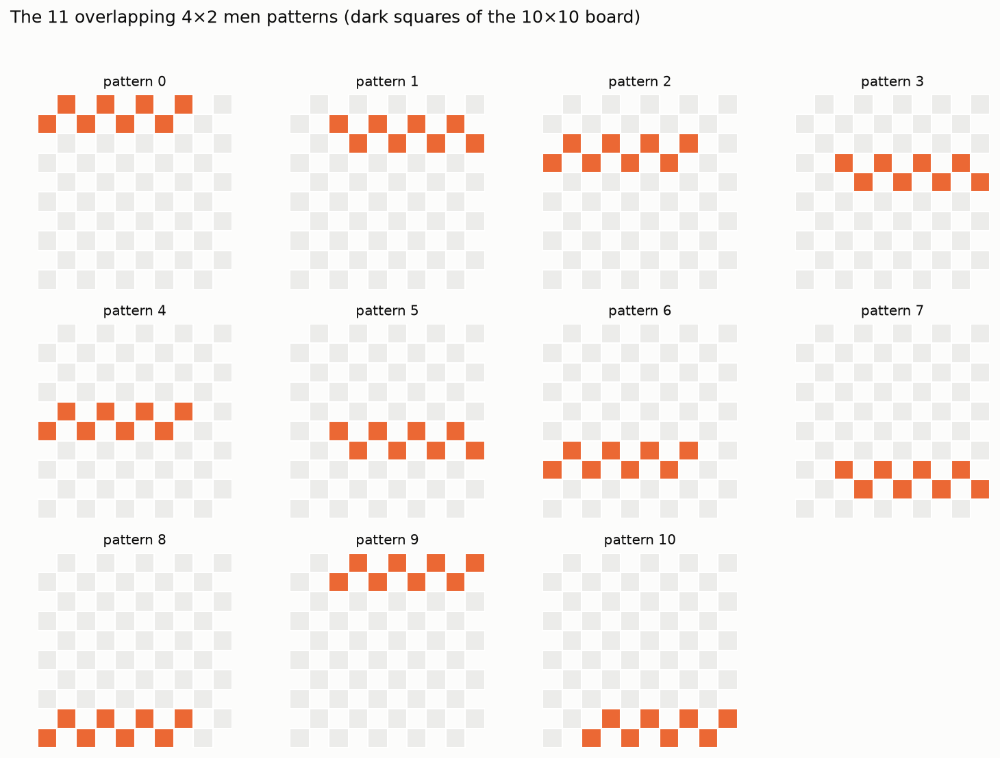
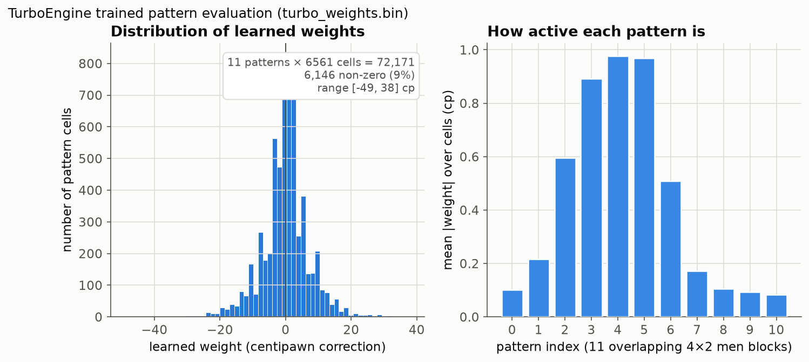
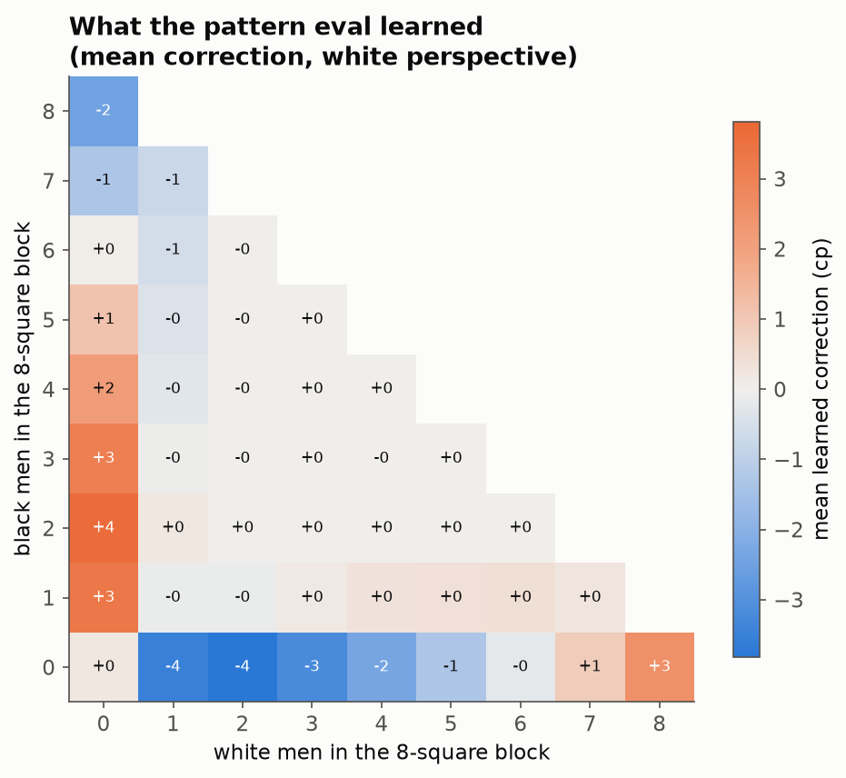
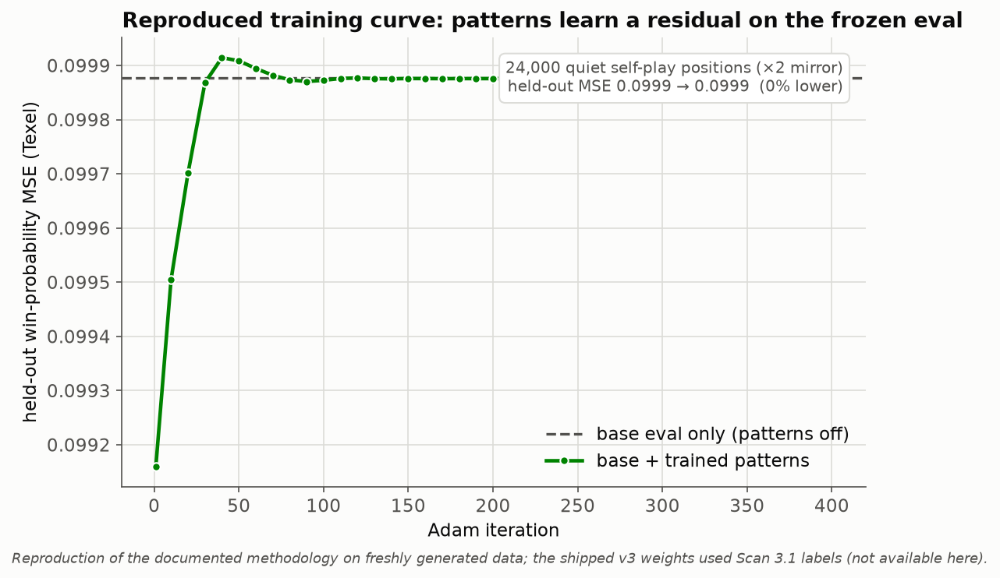
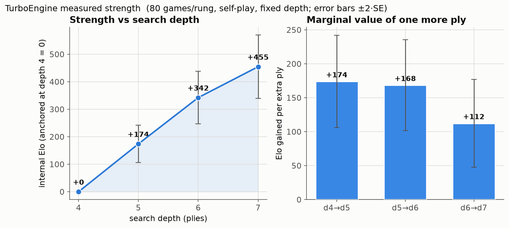
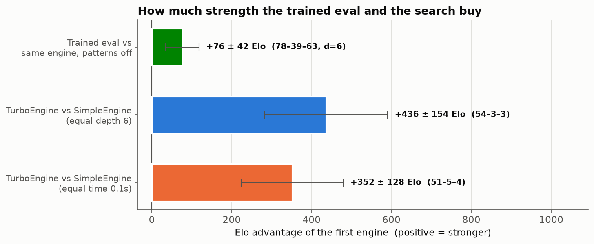

.. meta::
   :description: py-draughts engines — TurboEngine, a machine-learned pattern evaluation with PVS search for international draughts, and SimpleEngine, a general-purpose alpha-beta engine for every variant, plus a HUB protocol bridge for external engines like Scan and Kingsrow.
   :keywords: draughts engine, turboengine, machine-learned evaluation, alpha-beta draughts, hub protocol, scan engine, kingsrow, python checkers ai, transposition table

Engine
======

Two engines are built in: :class:`~draughts.TurboEngine` — the strongest, for
international 10x10 — and :class:`~draughts.SimpleEngine`, a lightweight
general-purpose engine that works on every variant.

Quick Start
-----------

.. code-block:: python

    from draughts import Board, TurboEngine

    board = Board()
    engine = TurboEngine(time_limit=0.5)   # strongest; international 10x10 only

    # Get best move
    best_move = engine.get_best_move(board)
    board.push(best_move)

    # Get move with evaluation score
    move, score = engine.get_best_move(board, with_evaluation=True)

Engine Interface
----------------

.. autoclass:: draughts.Engine
    :members:

TurboEngine
-----------

The strongest built-in engine, for the standard international (10x10) board
only. It uses Scan's 63-bit bitboard layout, a PVS search with transposition
table, and a machine-learned pattern evaluation trained on Scan self-play.
At equal search depth it beats :class:`~draughts.SimpleEngine` decisively while
searching in roughly a third of the time per move.

.. code-block:: python

    from draughts import Board, TurboEngine

    board = Board()
    engine = TurboEngine(time_limit=0.5)   # or depth_limit=...
    move, score = engine.get_best_move(board, with_evaluation=True)

.. autoclass:: draughts.TurboEngine
    :members: __init__, get_best_move

How it works
~~~~~~~~~~~~

TurboEngine follows the architecture of top international-draughts engines
(`Scan <https://hjetten.home.xs4all.nl/scan/scan.html>`_, Kingsrow) adapted to
a pure-Python leaf — no C extension, no numpy in the hot path.

**Board representation.** The 50 playing squares are packed into a 63-bit
integer with 13 unused "ghost" bits (Scan's layout) so that all four diagonal
steps become uniform shifts of 6 and 7. Move generation is whole-board integer
arithmetic — no per-square tables — and search is *copy-make* on four plain
``int`` bitboards (white men / white kings / black men / black kings) with no
board object and no move stack. Correctness is pinned by perft against the
BikDam reference counts and cross-validated move-for-move against Scan 3.1 (see
:doc:`the test suite <benchmarking>`).

**Search.** Principal-variation search with iterative deepening, aspiration
windows, a transposition table, late-move reductions, a single-reply extension,
and Scan-style forward pruning (a shallow verification search at a raised beta,
the draughts substitute for null-move pruning). Move ordering is TT-move-first
then an exponential-moving-average history heuristic. A quiescence stage
resolves every forced capture chain before a position is evaluated, with a
one-ply threat extension at the horizon so hanging pieces are never missed.

**Evaluation.** The static eval is computed straight from the bitboards. A
frozen "v2" hand eval supplies material and piece-square values (folded into
nine 128-entry chunk tables per bitboard for an O(9) lookup), cheap man
mobility, and a left/right balance term. On top of that sits the trained
pattern correction described next.

The machine-learned pattern evaluation
~~~~~~~~~~~~~~~~~~~~~~~~~~~~~~~~~~~~~~~~

The decisive structural lever in Scan/Kingsrow is a set of *overlapping local
men patterns* whose values are learned from games rather than hand-tuned.
TurboEngine ships eleven overlapping 4×2 blocks of board squares:

Each block's eight squares are encoded as base-3 digits (0 = empty, 1 = white
man, 2 = black man), giving a ``3**8 = 6561``-entry weight table per pattern.
Kings stay scalar (they are rare). At a leaf the trit index for each pattern is
extracted with two shifts, two masks and two table lookups — no per-square loop
— so the learned term costs eleven table reads. The weights are stored as
``int16`` in ``draughts/engines/turbo_weights.bin``; if that file is absent the
pattern term is simply zero and the eval degrades gracefully to the v2 hand
eval.

The learned weights are a small *residual correction* (roughly ±10–50 cp per
cell, a fraction of a man) layered on the material-dominated base eval. The
central patterns (which cover the squares that decide most middlegames) carry
the most weight. Averaging every cell by the local men balance shows the eval
learned sensible structure — it trims lopsided one-colour clusters that the raw
material term over-values and rewards holding pieces against a local enemy
majority:

How it was trained
~~~~~~~~~~~~~~~~~~~

Only the pattern weights are learned; the search and the v2 hand eval are
frozen, so the pure-Python leaf is unchanged. The offline pipeline
(``tools/train_pattern_eval.py``) is:

.. image:: _static/turbo_training_pipeline.png
   :alt: TurboEngine training pipeline
   :width: 780px

1. **Self-play.** Short rollouts from randomised openings — either Scan 3.1 at a
   fixed move time, or the frozen v2 engine at shallow depth — to produce a
   diverse position stream.
2. **Sample.** Keep only *fully quiet* positions (neither side has a capture),
   each labelled with the game's result and/or Scan's own search score from
   white's perspective.
3. **Features.** For every position: the fixed v2 hand eval as a constant
   offset, plus the eleven base-3 pattern indices. Every sample is also added
   180°-rotated with colours swapped, which removes side bias and doubles the
   signal.
4. **Fit.** A Texel-style logistic model ``p(white win) = sigmoid(K · E_white)``
   (or a least-squares regression toward Scan's score) is fit by full-batch Adam
   with L2 regularisation. The v2 eval is a fixed term; only the pattern
   residual and the scale ``K`` are trained.
5. **Ship.** The weights are rounded to ``int16`` and written to
   ``turbo_weights.bin``, which the engine loads with the standard library
   alone.

Fitting the residual measurably sharpens the evaluation's agreement with game
outcomes. The curve below is a fresh reproduction of the methodology on
self-play data generated on the spot (the shipped v3 weights used Scan 3.1
labels, which are not reproduced here):

**Reproduce it.** The trainer is self-contained; point it at a Scan binary for
the strongest labels, or let it self-play::

    # regenerate the shipped-style weights (needs a Scan engine for labels)
    python tools/train_pattern_eval.py --label scan --target scanreg \
        --games 6000 --workers 10 --out draughts/engines/turbo_weights.bin

Load your own weights (or disable the trained term) at runtime via the
``TURBO_WEIGHTS`` environment variable::

    TURBO_WEIGHTS=/path/to/my_weights.bin   # custom trained weights
    TURBO_WEIGHTS=none                       # disable → v2 hand eval only

Measured strength
~~~~~~~~~~~~~~~~~~

Strength was measured with ``tools/measure_turbo_elo.py`` and rendered by
``tools/generate_turbo_charts.py``. All headline figures use a **fixed search
depth**: wall-clock Elo is noisy and machine-dependent on a shared CPU, whereas
depth-limited games give the same result on any machine. Each number is an Elo
estimate with a ``±2·SE`` interval (win = 1, draw = ½, loss = 0). The internal
ladder is a *relative* scale anchored at the shallowest depth — with no
externally calibrated opponent (e.g. Scan) wired in, an absolute FMJD rating is
not claimed.

.. TURBO_ELO_TABLE

Two results stand out. First, the flagship gap: at equal search depth
TurboEngine overwhelms the general-purpose :class:`~draughts.SimpleEngine` while
spending far less time per move (≈100 ms vs ≈280 ms at depth 6). Second, the
**training payoff** — the same engine with the trained pattern term switched off
(``TURBO_WEIGHTS=none``) plays measurably weaker, isolating the Elo the offline
training actually bought on top of the frozen hand eval.

**Reproduce it**::

    # measure everything (depth ladder, flagship gap, training ablation)
    python tools/measure_turbo_elo.py --all --workers 3 \
        --out docs/source/_static/turbo_elo.json

    # rebuild every figure on this page (add --with-curve for the training curve)
    python tools/generate_turbo_charts.py --with-curve

SimpleEngine
------------

A lightweight general-purpose engine — alpha-beta search with a transposition
table and iterative deepening — that works on **every** board variant, unlike
:class:`~draughts.TurboEngine` (international only). Use it for American,
Frisian, Russian, Brazilian, and the other variants.

.. code-block:: python

    from draughts import Board, SimpleEngine

    board = Board()
    engine = SimpleEngine(depth_limit=5)
    move, score = engine.get_best_move(board, with_evaluation=True)

.. autoclass:: draughts.SimpleEngine
    :members: __init__, evaluate, get_best_move

Performance
~~~~~~~~~~~

``SimpleEngine`` search cost by depth:

============  ============  ============
Depth         Avg Time      Avg Nodes
============  ============  ============
5             274 ms        3,263
6             619 ms        7,330
7             2.20 s        21,642
8             6.55 s        98,987
============  ============  ============

- **Depth 5-6**: Strong play, responsive (< 1s per move)
- **Depth 7-8**: Very strong, suitable for analysis

.. image:: _static/engine_benchmark.png
   :alt: Engine Benchmark
   :width: 500px

HubEngine
---------

Use external engines implementing the Hub protocol (e.g., `Scan <https://hjetten.home.xs4all.nl/scan/scan.html>`_).

.. autoclass:: draughts.HubEngine
    :members: __init__, start, quit, get_best_move

Example::

    from draughts import Board, HubEngine

    with HubEngine("path/to/scan.exe", time_limit=1.0) as engine:
        board = Board()
        move, score = engine.get_best_move(board, with_evaluation=True)

Custom Engine
-------------

Inherit from :class:`~draughts.Engine` to create your own::

    from draughts import Engine
    import random

    class RandomEngine(Engine):
        def get_best_move(self, board, with_evaluation=False):
            move = random.choice(list(board.legal_moves))
            return (move, 0.0) if with_evaluation else move

Use with the :doc:`server` for interactive testing.

Benchmarking
------------

Compare two engines against each other with comprehensive statistics.

Quick Start
~~~~~~~~~~~

.. code-block:: python

    from draughts import Benchmark, SimpleEngine

    # Compare two engines
    stats = Benchmark(
        SimpleEngine(depth_limit=4),
        SimpleEngine(depth_limit=6),
        games=20
    ).run()

    print(stats)

Output::

    ============================================================
      BENCHMARK: SimpleEngine (d=4) vs SimpleEngine (d=6)
    ============================================================

      RESULTS: 2-12-6 (W-L-D)
      SimpleEngine (d=4) win rate: 25.0%
      Elo difference: -191

      PERFORMANCE
      Avg game length: 85.3 moves
      SimpleEngine (d=4): 25.2ms/move, 312 nodes/move
      SimpleEngine (d=6): 142.5ms/move, 1850 nodes/move
      Total time: 45.2s
      ...

Benchmark Class
~~~~~~~~~~~~~~~

.. autoclass:: draughts.Benchmark
    :members: __init__, run

Parameters
~~~~~~~~~~

- **engine1, engine2**: Any :class:`Engine` instances to compare
- **board_class**: Board variant (``StandardBoard``, ``AmericanBoard``, etc.)
- **games**: Number of games to play (default: 10)
- **openings**: List of FEN strings for starting positions
- **swap_colors**: Alternate colors between games (default: True)
- **max_moves**: Maximum moves per game (default: 200)
- **workers**: Parallel workers (default: 1, sequential)

Custom Names
~~~~~~~~~~~~

Engines with the same class name are automatically distinguished by their settings::

    # These will show as "SimpleEngine (d=4)" and "SimpleEngine (d=6)"
    Benchmark(
        SimpleEngine(depth_limit=4),
        SimpleEngine(depth_limit=6)
    )

Or provide custom names::

    Benchmark(
        SimpleEngine(depth_limit=4, name="FastBot"),
        SimpleEngine(depth_limit=6, name="StrongBot")
    )

Custom Openings
~~~~~~~~~~~~~~~

By default, 10x10 boards use built-in opening positions. Provide your own::

    from draughts import Benchmark, SimpleEngine, STANDARD_OPENINGS

    # Use specific FEN positions
    custom_openings = [
        "W:W31,32,33,34,35:B1,2,3,4,5",
        "B:W40,41,42:B10,11,12",
    ]

    stats = Benchmark(
        SimpleEngine(depth_limit=4),
        SimpleEngine(depth_limit=6),
        openings=custom_openings
    ).run()

    # Or use the built-in openings
    print(f"Available openings: {len(STANDARD_OPENINGS)}")

Different Board Variants
~~~~~~~~~~~~~~~~~~~~~~~~

Test engines on any supported variant::

    from draughts import Benchmark, SimpleEngine
    from draughts import AmericanBoard, FrisianBoard, RussianBoard

    # American checkers (8x8)
    stats = Benchmark(
        SimpleEngine(depth_limit=5),
        SimpleEngine(depth_limit=7),
        board_class=AmericanBoard,
        games=10
    ).run()

Saving Results to CSV
~~~~~~~~~~~~~~~~~~~~~

Save benchmark results to CSV for tracking over time::

    stats = Benchmark(e1, e2, games=20).run()
    stats.to_csv("benchmark_results.csv")

If the file exists, results are appended. The CSV includes:

- Timestamp, engine names, game count
- Wins, losses, draws, win rate, Elo difference
- Average moves, time per move, nodes per move
- Total benchmark time

Statistics
~~~~~~~~~~

The :class:`BenchmarkStats` object provides:

- **games**: Total games played
- **e1_wins, e2_wins, draws**: Win/loss/draw counts
- **e1_win_rate**: Engine 1's win rate (0.0-1.0)
- **elo_diff**: Estimated Elo difference (positive = engine1 stronger)
- **avg_moves**: Average game length
- **avg_time_e1, avg_time_e2**: Average time per move
- **avg_nodes_e1, avg_nodes_e2**: Average nodes searched per move
- **results**: List of individual :class:`GameResult` objects

.. autoclass:: draughts.BenchmarkStats
    :members:

.. autoclass:: draughts.GameResult
    :members: