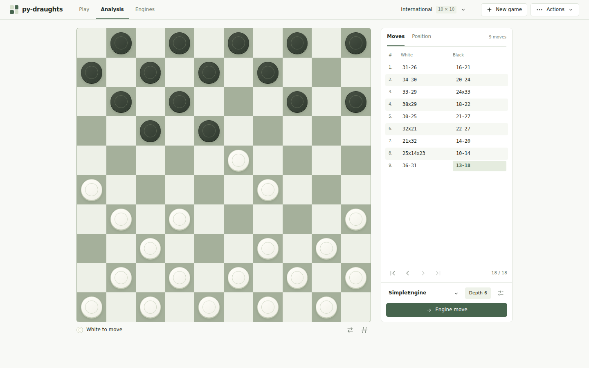
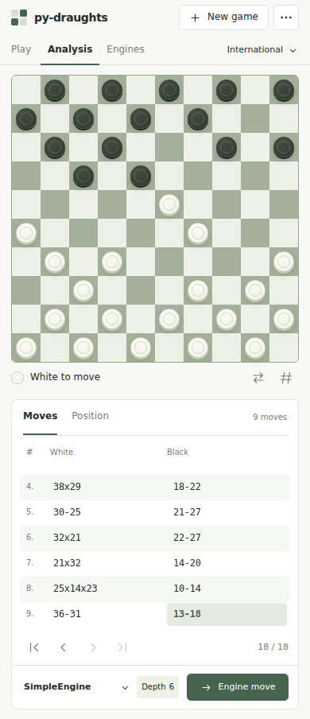

.. meta::
   :description: Drop-in FastAPI web server for playing draughts and checkers in the browser — interactive board, engine vs engine matches, position analysis.
   :keywords: draughts web ui, online checkers, fastapi draughts server, play draughts python, engine match ui

Server
======

Web interface for playing draughts games interactively. The desktop and mobile
images below were captured from the running FastAPI server.

   Desktop analysis view.

   Mobile layout. The move panel sits below the board.

.. autoclass:: draughts.Server
    :members: __init__, run

Quick Start
-----------

.. code-block:: python

    from draughts import Board, Server, SimpleEngine

    board = Board()
    server = Server(
        board=board,
        white_engine=SimpleEngine(depth_limit=6),
        black_engine=SimpleEngine(depth_limit=4)
    )
    server.run()  # Open http://localhost:8000

Command Line
~~~~~~~~~~~~

Start directly from terminal::

    python -m draughts.server.server

Engine Matches
--------------

Pit engines against each other::

    from draughts import Board, Server, SimpleEngine, Engine
    import random

    class RandomEngine(Engine):
        def get_best_move(self, board, with_evaluation=False):
            move = random.choice(list(board.legal_moves))
            return (move, 0.0) if with_evaluation else move

    server = Server(
        board=Board(),
        white_engine=SimpleEngine(depth_limit=6),
        black_engine=RandomEngine()
    )
    server.run()

Click "Auto Play" in the UI to watch the match.

Web UI Controls
---------------

- **Play / Analysis / Engines**: Switch between the board controls and automatic
  engine play. These views share the same game.
- **New game**: Reset the board and choose any of the eight supported variants.
- **Board**: Select a piece to see legal destinations, then select a destination
  to move. Use the controls below the board to flip it or show square numbers.
- **Moves / Position**: Navigate recorded moves backward and forward, or inspect
  the current FEN, legal-move count, and material. Playing from an earlier
  position replaces the later moves.
- **Engine move**: Ask the engine configured for the current side to play one
  move. Set its depth in Engine settings (1–10). Engine choice is configured
  when creating the Python ``Server``, not in the browser.
- **Auto play**: Start or stop continuous play in the Engines view when both
  sides have engines configured. Stopping waits for an in-progress move to
  finish.
- **Actions**: Import FEN or PDN, export FEN/PDN or an SVG board, copy a Python
  API example for the current position, and toggle dark mode.

The ``Server`` holds one shared board. Opening it in multiple browser tabs does
not create separate games.

API Endpoints
-------------

======================== ====== ==============================
Endpoint                 Method Description
======================== ====== ==============================
``/position``            GET    Current board position
``/legal_moves``         GET    Legal moves for current player
``/fen``                 GET    FEN string
``/pdn``                 GET    PDN string
``/engine_info``         GET    Configured engines and depth
``/move/{src}/{tgt}``    POST   Make a move
``/best_move``           GET    Play engine's best move
``/pop``                 GET    Undo last move
``/goto/{ply}``          GET    Navigate recorded half-moves
``/load_fen``            POST   Load position from FEN
``/load_pdn``            POST   Load game from PDN
``/set_depth/{depth}``   GET    Set engine search depth (1–10)
``/set_board/{variant}`` GET    Reset to a supported variant
======================== ====== ==============================
