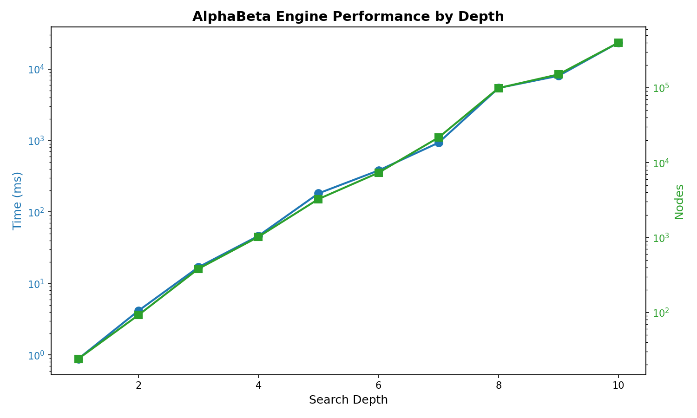
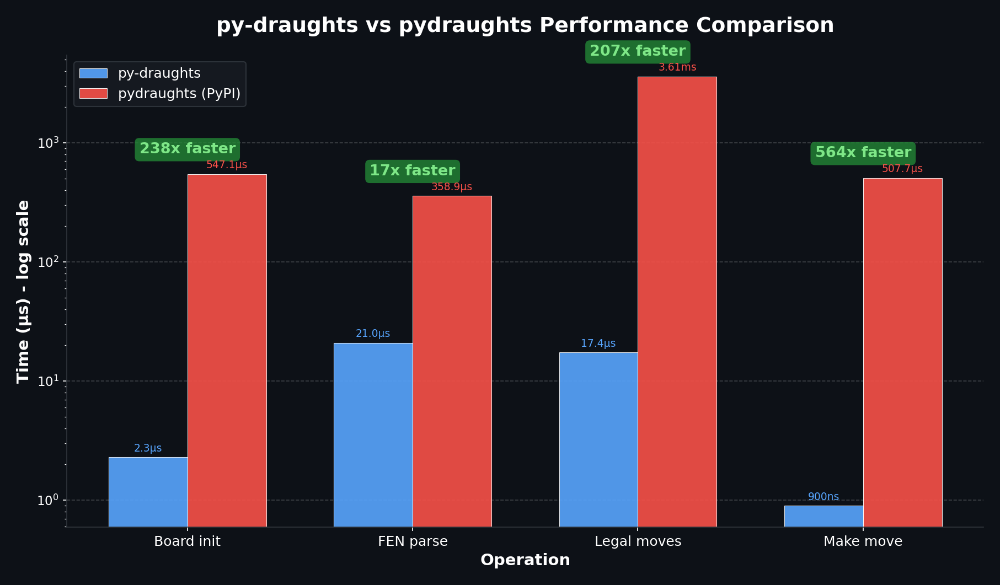

# py-draughts

[](https://github.com/michalskibinski109/checkers/actions/workflows/python-app.yml)
[](https://badge.fury.io/py/py-draughts)
[](https://pepy.tech/project/py-draughts)

Efficient modern and flexible implementation of the draughts game with a beautiful web interface. 
Supports variants `frisian`, `standard (International)`, `English (american)` and `russian` variants of the game and allows playing against AI.

> [!IMPORTANT]  
> This is best optimized draughts library utilizing C types and bitboards


## Installation

```bash
pip install py-draughts
```


### [Documentation](https://miskibin.github.io/py-draughts/)

## Key features

-  Displays simple ascii board for different variants of the game.

```python
>>> from draughts import get_board
>>> board = get_board('standard', "W:W4,11,28,31,K33,K34,38,40,K41,43,K44,45,K46,47:BK3,21,27,32")
>>> board
 . . . . . B . w . .
 . . . . . . . . . .
 . w . . . . . . . .
 . . . . . . . . . .
 . b . . . . . . . .
 . . b . w . . . . .
 . w . b . W . W . .
 . . . . w . . . w .
 . W . . . w . W . w
 W . w . . . . . . .

>>> board = get_board("american")
>>> board
 . b . b . b . b
 b . b . b . b .
 . b . b . b . b
 . . . . . . . .
 . . . . . . . .
 w . w . w . w .
 . w . w . w . w
 w . w . w . w .


- Make and undo moves

```python
>>> board.push_uci("31-27")
>>> board.pop() # undo last move
Move: 31->27
>>> board.turn
Color.WHITE
```

- detects draws and wins

> [!Important]  
> Those methods are variant specific. Each variant has different set of them.


```python
>>> board.game_over
False
>>> board.is_threefold_repetition
False
>>> board.is_5_moves_rule
False
>>> board.is_16_moves_rule
False
>>> board.is_25_moves_rule
False
>>> board.is_draw
False
```

- Validate and generate moves

```python
>>> board.push_uci("31-22")
ValueError: 31-22 is correct, but not legal in given position.
Legal moves are: ['31-27', '31-26', '32-28', '32-27', '33-29', '33-28', '34-30', '34-29', '35-30']

>>> list(board.legal_moves)
['31-27', '31-26', '32-28', '32-27', '33-29', '33-28', '34-30', '34-29', '35-30']
```

- Reads and writes fen strings


- Writes PDN strings

```python
>>> board.push_uci("31-27")
>>> board.push_uci("32-28")
>>> board.push_uci("27-23")
>>> board.push_uci("28-24")

>>> board.pdn
'[GameType "20"]
 [Variant "Standard (international) checkers"]
 [Result "-"]
 1. 31-27 32-28 2. 27-23 28-24'
```

- Reads PDN strings

```python
>>> pdn = '''[GameType "20"]
... 1. 32-28 19-23 2. 28x19 14x23'''
>>> board = StandardBoard.from_pdn(pdn)
>>> board
 . b . b . b . b . b
 b . b . b . b . b .
 . b . b . b . b . b
 b . . . b . b . b .
 . . . b . . . . . .
 . . . . . . . . . .
 . w . w . w . w . w
 w . w . w . w . w .
 . w . w . w . w . w
 w . w . w . w . w .
```

- Renders board as SVG image

```python
>>> import draughts
>>> board = draughts.StandardBoard()
>>> draughts.svg.board(board, size=400)
```


```python
>>> board = draughts.StandardBoard.from_fen("W:WK10,K20:BK35,K45")
>>> draughts.svg.board(board, size=400)
```


- Has powerful AI engine

```python
>>> from draughts.engine import AlphaBetaEngine
>>> engine = AlphaBetaEngine(depth_limit=5)
>>> engine.get_best_move(board, with_evaluation=True)
Move: 28->37, 3.0
```

The engine uses **alpha-beta pruning** with several optimizations:
- **Move ordering**: Captures are evaluated first for better pruning
- **Transposition table**: Caches positions to avoid redundant calculations  
- **Enhanced evaluation**: Considers material, positioning, and king promotion

**Performance guide:**
- Depth 3-4: Instant, good for interactive play (~10-35ms per move)
- Depth 5-6: Strong play, very responsive (~130-350ms per move)
- Depth 7-8: Very strong, suitable for analysis (~1-5s per move)
- Depth 9-10: Maximum strength (~6-26s per move)

### External Engine Support (Hub Protocol)

You can also use external draughts engines like [Scan](https://hjetten.home.xs4all.nl/scan/scan.html) 
via the Hub protocol:

```python
>>> from draughts import HubEngine, StandardBoard
>>> with HubEngine("path/to/scan.exe", time_limit=1.0) as engine:
...     board = StandardBoard()
...     move, score = engine.get_best_move(board, with_evaluation=True)
...     print(f"Best move: {move}, Score: {score}")
Best move: 32-28, Score: 0.15
```

The `HubEngine` class:
- Manages the external engine subprocess lifecycle
- Auto-detects variant from board type (Standard, Frisian)
- Supports time-based (`time_limit`) or depth-based (`depth_limit`) search
- Works as a drop-in replacement for `AlphaBetaEngine`

## Web UI

The server provides a web interface for:

1. Playing draughts with interactive board
2. Running engine vs engine matches
3. Testing and debugging custom engines

```python
python -m draughts.server.server
```

#### Engine vs Engine Match

Pit two engines against each other and watch them play:

```python
from draughts import get_board
from draughts.engine import AlphaBetaEngine
from draughts.server import Server

board = get_board('standard')

# Create engines with different configurations
white_engine = AlphaBetaEngine(depth_limit=6)
black_engine = AlphaBetaEngine(depth_limit=4)

server = Server(
    board=board,
    white_engine=white_engine,
    black_engine=black_engine
)
server.run()
```

Open http://localhost:8000 and click "Auto Play" to watch the match!

#### Custom Engine Integration

```python
from draughts import get_board
from draughts.engine import Engine
from draughts.server import Server
import random

class MyEngine(Engine):
    def get_best_move(self, board, with_evaluation=False):
        move = random.choice(list(board.legal_moves))
        return (move, 0.0) if with_evaluation else move

board = get_board('standard')
server = Server(
    board=board,
    white_engine=MyEngine(),
    black_engine=AlphaBetaEngine(depth_limit=5)
)
server.run()
```

> [!Warning]  
> Server will not start when using _google colab_

---


## Contributing

Contributions to this project are welcome. If you encounter any issues or have suggestions for improvements, please open an issue or submit a pull request on the project repository.

## Logging

Logging is disabled by default. To enable debug logs, configure loguru before importing draughts:

```python
from loguru import logger
import sys

logger.add(sys.stderr, level="DEBUG")

from draughts import get_board  # Now shows debug logs
```


### ⚡ Performance

Legal moves generation in **~10-30 microseconds**. Engine search is highly optimized:

| Depth | Time | Nodes |
|-------|------|-------|
| 5 | 130 ms | 3,525 |
| 6 | 350 ms | 9,537 |
| 7 | 933 ms | 25,202 |
| 8 | 4.9 s | 122,168 |



### Speed Comparison vs pydraughts

Comparison against [pydraughts](https://pypi.org/project/pydraughts/) (v0.6.7) on Standard (International) draughts:

| Operation | py-draughts | pydraughts | Speedup |
|-----------|-------------|------------|---------|
| Board init | 2.30 µs | 547.10 µs | **238x faster** |
| FEN parse | 21.00 µs | 358.90 µs | **17x faster** |
| Legal moves | 17.40 µs | 3.61 ms | **207x faster** |
| Make move | 0.90 µs | 507.75 µs | **564x faster** |



> Benchmarked with 1000 iterations across 6 test positions. Run `python tools/compare_pydraughts.py` to reproduce.

## Bibliography

1. [Notation](https://en.wikipedia.org/wiki/Portable_Draughts_Notation)
2. [Rules and variants](https://en.wikipedia.org/wiki/Checkers)
3. [List of PDNs](https://github.com/mig0/Games-Checkers/)
4. [Draughts online](https://lidraughts.org/)
5. [Additional 1 (Checkers online)](https://checkers.online/play)
6. [Additional 2 (Chinook)](https://webdocs.cs.ualberta.ca/~chinook/play/notation.html)
