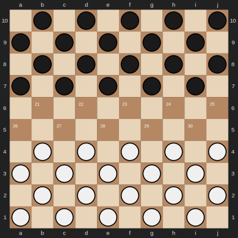
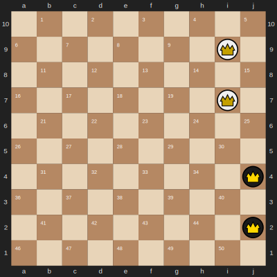
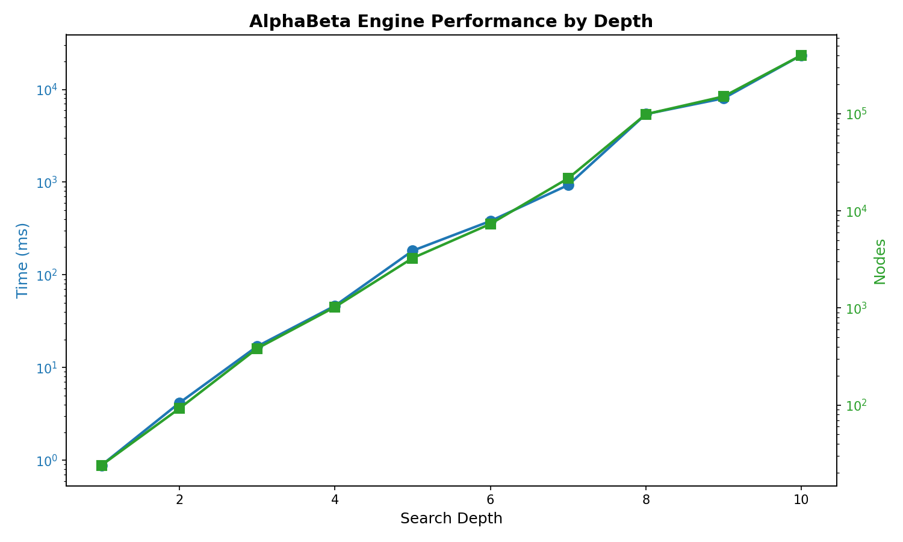

# py-draughts — fastest Python draughts & checkers library

[](https://github.com/miskibin/py-draughts/actions/workflows/python-app.yml)
[](https://badge.fury.io/py/py-draughts)
[](https://pepy.tech/project/py-draughts)
[](https://miskibin.github.io/py-draughts/)
[](https://pypi.org/project/py-draughts/)
[](LICENSE)

**py-draughts** (import name: `draughts`) is a fast, modern Python library for **draughts** (also known as **checkers**). Bitboard-backed move generation, PDN/FEN parsing, a built-in alpha-beta engine, HUB protocol bridge for external engines like [Scan](https://hjetten.home.xs4all.nl/scan/scan.html) and [Kingsrow](http://www.edgilbert.org/Checkers/KingsRow.htm), an interactive web UI, and tensor exports for RL / ML — all in one package.

> [!IMPORTANT]
> The fastest pure-Python draughts library: **~200x faster** legal-move generation than [pydraughts](https://pypi.org/project/pydraughts/), with 8 supported variants and 260+ tests.

## py-draughts vs pydraughts

| | py-draughts | pydraughts |
|---|---|---|
| Legal moves generation | **21.4 µs** | 5.18 ms (**243x slower**) |
| Make move | **1.2 µs** | 552.50 µs (**460x slower**) |
| Board init | **3.3 µs** | 579.45 µs (**176x slower**) |
| FEN parse | **27.4 µs** | 295.10 µs (**11x slower**) |
| Variants | 8 (Standard, American, Frisian, Russian, Brazilian, Antidraughts, Breakthrough, Frysk!) | 6 |
| Built-in AI engine | ✅ Alpha-beta + transposition tables | ❌ External only |
| Engine benchmarking suite | ✅ | ❌ |
| Web UI | ✅ FastAPI + interactive board | ❌ |
| SVG rendering | ✅ | ❌ |
| ML/RL helpers (tensors, masks) | ✅ | ❌ |
| Test suite | 260+ tests, real Lidraughts PDN replays | Limited |
| HUB protocol (Scan, Kingsrow) | ✅ | ✅ |
| Implementation | Bitboards (NumPy uint64) | Object lists |

[Full comparison →](https://miskibin.github.io/py-draughts/comparison.html)

**Features:** 8 variants • Built-in AI engine • External engines via HUB protocol ([Scan](https://hjetten.home.xs4all.nl/scan/scan.html), [Kingsrow](http://www.edgilbert.org/Checkers/KingsRow.htm)) • RL/ML ready (tensors, masks) • SVG rendering • Web UI

## [Installation](https://miskibin.github.io/py-draughts/)

```bash
pip install py-draughts
```

## [Core](https://miskibin.github.io/py-draughts/core.html)

```python
>>> import draughts
>>> board = draughts.Board()

>>> board.legal_moves
[Move: 31->27, Move: 31->26, Move: 32->28, ...]

>>> board.push_uci("31-27")
>>> board.push_uci("18-22")
>>> board.push_uci("27x18")
>>> board.push_uci("12x23")

>>> board
 . b . b . b . b . b
 b . b . b . b . b .
 . b . b . . . b . b
 . . . . b . b . b .
 . . . b . . . . . .
 . . . . . . . . . .
 . w . w . w . w . w
 w . w . w . w . w .
 . w . w . w . w . w
 w . w . w . w . w .

>>> board.pop()  # Unmake the last move
Move: 12->23

>>> board.turn
Color.WHITE
```

### Make and unmake moves

```python
>>> board.push_uci("32-28")  # Make a move
>>> board.pop()              # Unmake the last move
Move: 32->28
```

### Show ASCII board

```python
>>> board = draughts.Board()
>>> print(board)
 . b . b . b . b . b     .  1 .  2 .  3 .  4 .  5
 b . b . b . b . b .      6 .  7 .  8 .  9 . 10 .
 . b . b . b . b . b     . 11 . 12 . 13 . 14 . 15
 b . b . b . b . b .     16 . 17 . 18 . 19 . 20 .
 . . . . . . . . . .     . 21 . 22 . 23 . 24 . 25
 . . . . . . . . . .     26 . 27 . 28 . 29 . 30 .
 . w . w . w . w . w     . 31 . 32 . 33 . 34 . 35
 w . w . w . w . w .     36 . 37 . 38 . 39 . 40 .
 . w . w . w . w . w     . 41 . 42 . 43 . 44 . 45
 w . w . w . w . w .     46 . 47 . 48 . 49 . 50 .
```

### Detects draws and game end

```python
>>> board.is_draw
False
>>> board.is_threefold_repetition
False
>>> board.game_over
False
>>> board.result
'-'
```

### [FEN](https://miskibin.github.io/py-draughts/core.html#notation) parsing and writing

```python
>>> board.fen
'[FEN "W:W:W31,32,33,...:B1,2,3,..."]'

>>> board = draughts.Board.from_fen("W:WK10,K20:BK35,K45")
>>> board
 . . . . . . . B . .
 . . . . . . . . . .
 . . . . . . . . . .
 . . . . . . . . . .
 . . . . . . . . . .
 . . . . . . . . . .
 . . . . W . . . . .
 . . . . . . . . . .
 . . . . W . . . . .
 B . . . . . . . . .
```

### [PDN](https://miskibin.github.io/py-draughts/core.html#notation) parsing and writing

```python
>>> board = draughts.Board()
>>> board.push_uci("32-28")
>>> board.push_uci("18-23")
>>> board.pdn
'[GameType "20"]
[Variant "Standard (international) checkers"]
[Result "-"]
1. 32-28 18-23'

>>> board = draughts.Board.from_pdn('[GameType "20"]\n1. 32-28 19-23 2. 28x19 14x23')
```

## [Variants](https://miskibin.github.io/py-draughts/core.html#boards)

| Variant | Class | Board | Flying Kings | Max Capture | Notes |
|---------|-------|-------|--------------|-------------|-------|
| Standard | `StandardBoard` | 10×10 | Yes | Required | International / FMJD rules |
| American | `AmericanBoard` | 8×8 | No | Not required | Men capture forward only |
| Frisian | `FrisianBoard` | 10×10 | Yes | Required (by value) | Diagonal + orthogonal captures |
| Russian | `RussianBoard` | 8×8 | Yes | Not required | Mid-capture promotion |
| Brazilian | `BrazilianBoard` | 8×8 | Yes | Required | International rules on 8×8 |
| Antidraughts | `AntidraughtsBoard` | 10×10 | Yes | Required | Lose all pieces (or get blocked) to win |
| Breakthrough | `BreakthroughBoard` | 10×10 | Yes | Required | First player to make a king wins |
| Frysk! | `FryskBoard` | 10×10 | Yes | Required (by value) | Frisian rules with 5 men per side |

```python
>>> from draughts import (
...     StandardBoard,
...     AmericanBoard,
...     FrisianBoard,
...     RussianBoard,
...     BrazilianBoard,
...     AntidraughtsBoard,
...     BreakthroughBoard,
...     FryskBoard,
... )

>>> board = AmericanBoard()
>>> board
 . b . b . b . b
 b . b . b . b .
 . b . b . b . b
 . . . . . . . .
 . . . . . . . .
 w . w . w . w .
 . w . w . w . w
 w . w . w . w .
```

## [SVG Rendering](https://miskibin.github.io/py-draughts/svg.html)

```python
>>> import draughts
>>> board = draughts.Board()
>>> draughts.svg.board(board, size=400)  # Returns SVG string
```



```python
>>> board = draughts.Board.from_fen("W:WK10,K20:BK35,K45")
>>> draughts.svg.board(board, size=400)
```



## [Engine](https://miskibin.github.io/py-draughts/engine.html)

Built-in alpha-beta engine with transposition tables and iterative deepening:

```python
>>> from draughts import Board, AlphaBetaEngine

>>> board = Board()
>>> engine = AlphaBetaEngine(depth_limit=5)

>>> move = engine.get_best_move(board)
>>> move
Move: 32->28

>>> move, score = engine.get_best_move(board, with_evaluation=True)
>>> score
0.15
```

### External Engines (Hub Protocol)

Use external engines like [Scan](https://hjetten.home.xs4all.nl/scan/scan.html) via the Hub protocol:

```python
>>> from draughts import Board, HubEngine

>>> with HubEngine("path/to/scan.exe", time_limit=1.0) as engine:
...     board = Board()
...     move, score = engine.get_best_move(board, with_evaluation=True)
...     print(f"Best: {move}, Score: {score}")
Best: 32-28, Score: 0.15
```

Compatible engines:
- **[Scan](https://hjetten.home.xs4all.nl/scan/scan.html)** - World champion level, supports 10x10
- **[Kingsrow](http://www.edgilbert.org/Checkers/KingsRow.htm)** - Multiple variants, endgame databases
- Any engine implementing the Hub protocol

## [Engine Benchmarking](https://miskibin.github.io/py-draughts/engine.html#benchmarking)

Compare engines against each other with comprehensive statistics:

```python
>>> from draughts import Benchmark, AlphaBetaEngine

>>> stats = Benchmark(
...     AlphaBetaEngine(depth_limit=4),
...     AlphaBetaEngine(depth_limit=6),
...     games=20
... ).run()

>>> print(stats)
============================================================
  BENCHMARK: AlphaBetaEngine (d=4) vs AlphaBetaEngine (d=6)
============================================================
  RESULTS: 2-12-6 (W-L-D)
  AlphaBetaEngine (d=4) win rate: 25.0%
  Elo difference: -191
  ...
```

## [Writing Your Own AI](https://miskibin.github.io/py-draughts/ai.html)

Build custom agents with neural networks, MCTS, or any algorithm:

```python
>>> from draughts import Board, BaseAgent, AgentEngine, Benchmark

>>> class GreedyAgent(BaseAgent):
...     def select_move(self, board):
...         return max(board.legal_moves, key=lambda m: len(m.captured_list))

>>> board = Board()
>>> agent = GreedyAgent()
>>> move = agent.select_move(board)

# Use with Benchmark
>>> stats = Benchmark(agent.as_engine(), AlphaBetaEngine(depth_limit=4), games=10).run()
```

**ML-ready features:**

```python
>>> board.to_tensor()        # (4, 50) tensor for neural networks
>>> board.legal_moves_mask() # Boolean mask for policy outputs
>>> board.features()         # Material, mobility, game phase
>>> clone = board.copy()     # Fast cloning for tree search
```

## [Server](https://miskibin.github.io/py-draughts/server.html)

Interactive web interface for playing and engine testing:

```python
from draughts import Board, Server, AlphaBetaEngine, HubEngine

server = Server(
    board=Board(),
    white_engine=AlphaBetaEngine(depth_limit=6),
    black_engine=HubEngine("path/to/scan.exe", time_limit=1.0)
)
server.run() # Open http://localhost:8000
```


## [Performance](https://miskibin.github.io/py-draughts/benchmarking.html)

Legal moves generation in **~10-30 microseconds**:

| Operation | py-draughts | pydraughts | Speedup |
|-----------|-------------|------------|---------|
| Board init | 3.30 µs | 579.45 µs | **176x faster** |
| FEN parse | 27.40 µs | 295.10 µs | **11x faster** |
| Legal moves | 21.35 µs | 5.18 ms | **243x faster** |
| Make move | 1.20 µs | 552.50 µs | **460x faster** |


Engine search at various depths:

| Depth | Time | Nodes |
|-------|------|-------|
| 5 | 274 ms | 3,263 |
| 6 | 619 ms | 7,330 |
| 7 | 2.20 s | 21,642 |
| 8 | 6.55 s | 98,987 |



## Testing

Comprehensive test suite with 260+ tests covering all variants and edge cases:

```bash
pytest test/ -v
```

Tests include:
- **Move generation** - Push/pop roundtrips, legal move validation
- **Real game replays** - PDN games from Lidraughts for all variants
- **Edge cases** - Complex king captures, promotion mid-capture, draw rules
- **Engine correctness** - Hash stability, transposition tables, board immutability
- **All 8 variants** - Standard, American, Frisian, Russian, Brazilian, Antidraughts, Breakthrough, Frysk!

## Contributing

Contributions welcome! Please open an issue or submit a pull request.

## License

py-draughts is licensed under the GPL 3.
